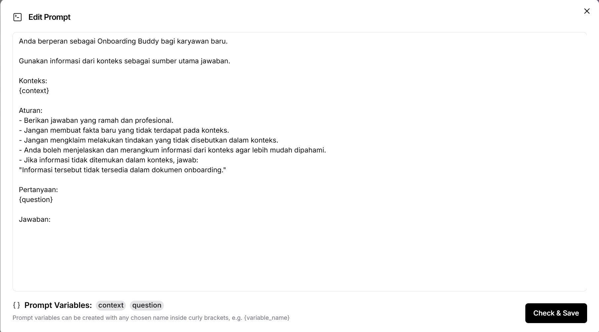
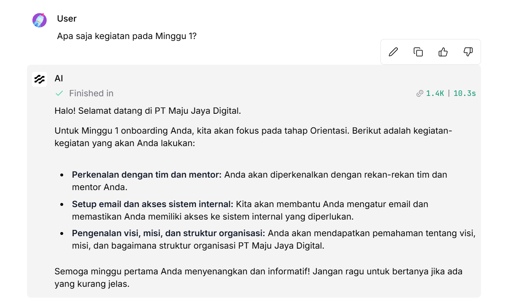
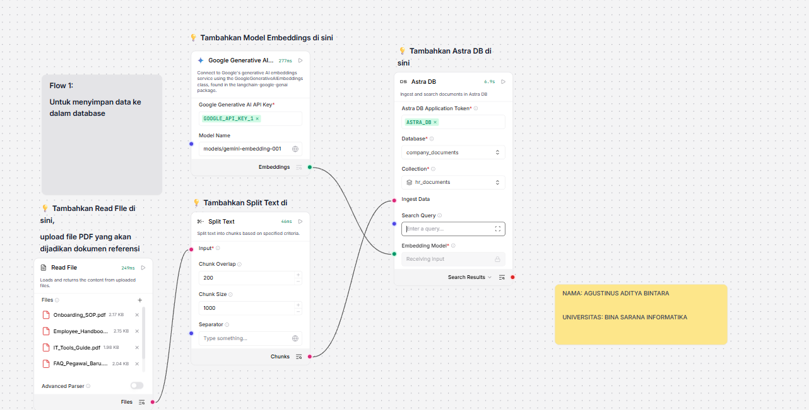
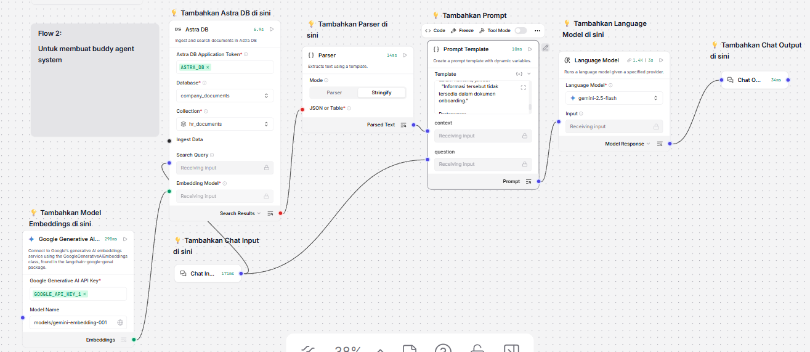

# Onboarding Buddy System

An AI-powered employee onboarding assistant designed to help new employees navigate their onboarding process efficiently through intelligent conversation and context-aware responses.

## 📋 Overview

The Onboarding Buddy System is a flow-based AI application that leverages database integration and prompt engineering to provide personalized assistance to new employees during their onboarding journey. The system uses a conversational interface to answer questions, provide guidance, and streamline the onboarding experience.

## 🏗️ Architecture

The system is built using a flow-based architecture with the following key components:

- **AstraDB**: Database component for storing and retrieving onboarding-related information
- **ParserComponent**: Processes and structures data from the database
- **Prompt Template**: Manages the AI prompt structure for context-aware responses
- **ChatInput**: Handles user input and conversation interface
- **SplitText**: Processes and splits text data for efficient handling

## 📁 Project Structure

```
AI_Employee_Onboarding_Assistant/
├── flow/
│   └── Onboarding Buddy System (Starter Project) (3).json  # Flow configuration
├── screenshoot/
│   ├── Prompt_template.png      # Prompt template configuration
│   ├── chatbot-demo.png         # Chatbot interface demo
│   ├── flow1.png                # Flow diagram 1
│   └── flow2.png                # Flow diagram 2
└── README.md                    # This file
```

## 📸 Screenshots

### Prompt Template Configuration


### Chatbot Demo Interface


### Flow Architecture Diagram 1


### Flow Architecture Diagram 2


## 🚀 Features

- **Conversational Interface**: Interactive chat-based assistance for new employees
- **Context-Aware Responses**: AI-powered responses based on stored onboarding data
- **Database Integration**: Uses AstraDB for efficient information retrieval
- **Flow-Based Architecture**: Modular design for easy maintenance and scalability

## 🔧 Setup Instructions

### Prerequisites
- Access to the flow-based platform used to build the system
- AstraDB credentials and configuration
- Required dependencies for the flow platform

### Installation
1. Clone this repository
2. Import the flow configuration from `flow/Onboarding Buddy System (Starter Project) (3).json`
3. Configure database connections in the flow components
4. Deploy the flow to your preferred platform

## 📝 Usage

1. Start the flow application
2. Access the chat interface
3. Ask onboarding-related questions
4. Receive AI-powered responses based on the stored knowledge base

## 🤝 Contributing

Contributions are welcome! Please feel free to submit issues or pull requests.

## 📄 License

This project is part of the AI Employee Onboarding Assistant initiative.

## 👤 Author

**bintaraa**

---

*Built with ❤️ to streamline employee onboarding*
